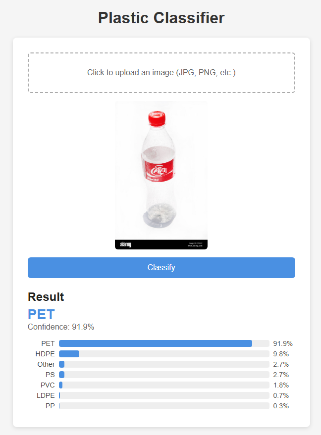

# Plastic Classifier

A deep learning web app that classifies plastic images into one of seven categories using a fine-tuned ResNet-50 model trained with PyTorch. Upload your own image to see its plastic type.

## 🌐 Live Demo

**[https://plasticclassifier.onrender.com/](https://plasticclassifier.onrender.com/)**



---

## Supported Plastic Types

| Label | Description |
|-------|-------------|
| HDPE  | High-Density Polyethylene (milk jugs, detergent bottles) |
| LDPE  | Low-Density Polyethylene (shopping bags, squeeze bottles) |
| Other | Mixed or unidentified plastics |
| PET   | Polyethylene Terephthalate (water bottles, food trays) |
| PP    | Polypropylene (tupperware, bottle caps) |
| PS    | Polystyrene (foam cups, plastic cutlery) |
| PVC   | Polyvinyl Chloride (pipes, window frames) |

---

## Project Structure

```
PlasticClassifier/
├── app.py                          # Flask web application
├── Dockerfile                      # Docker deployment config
├── .dockerignore
├── plastic_classifier.pth          # Trained model weights
├── plastic_classifier_pytorch.ipynb # Training notebook
├── requirements.txt
├── templates/
│   └── index.html                  # Upload UI
├── Data/
│   └── Plastic Classification/     # Training images (per-class folders)
└── ExternalImages/                 # Sample test images
```

---

## Local Setup

### 1. Clone / open the project

```bash
cd PlasticClassifier
```

### 2. Install dependencies

```bash
pip install -r requirements.txt
```

---

## Running Locally

```bash
python app.py
```

Then open **http://127.0.0.1:5000** in your browser.

---

## Running with Docker

```bash
docker build -t plastic-classifier .
docker run -p 5000:5000 plastic-classifier
```

Then open **http://127.0.0.1:5000** in your browser.

---

## Tech Stack

- **Model:** ResNet-50 (pretrained on ImageNet, fine-tuned on plastic dataset)
- **Framework:** PyTorch + torchvision
- **Web:** Flask + plain HTML/CSS/JS
- **Deployment:** Docker on Render